<!-- TITLE:START -->
# Cloud Product Mapping (AWS vs Azure vs GCP vs Oracle vs Exoscale)
<!-- TITLE:END -->

As we can see a lot of companies today decide to go with a multi-cloud strategy. Here is the overview where all major services between AWS, Azure, GCP, OCI and the European cloud provider [Exoscale](https://www.exoscale.com/) are mapped with links pointing to product home pages (Exoscale entries use the [official icons](https://community.exoscale.com/tools/icon-table/)).

👉 **Interactive version:** open [`docs/index.html`](docs/index.html) to include/exclude cloud providers, search products and switch between dark and light themes.

### Regenerating the mapping

The mapping below is generated from the JSON files in [`data/`](data/). Edit those, then run:

```bash
python3 scripts/build.py                               # all providers enabled in data/providers.json
python3 scripts/build.py --providers aws,azure,exoscale  # only these providers, in this order
python3 scripts/build.py --exclude oracle              # everything except Oracle
python3 scripts/render.py                              # PNG + PDF posters (dark and light, full and brief)
```

Exoscale entries tagged _(Marketplace)_ are partner offerings from the [Exoscale Marketplace](https://www.exoscale.com/marketplace/); _(Roadmap)_ marks planned services, and _(Workaround)_ means no managed service exists but the use case can be covered with Exoscale building blocks plus open-source tooling. An [AWS → Exoscale service crosswalk](#aws--exoscale-service-crosswalk) follows the category mapping.

## Support My Work

If you find this repository helpful, consider supporting me on Patreon:

[](https://www.patreon.com/techworld_with_milan)

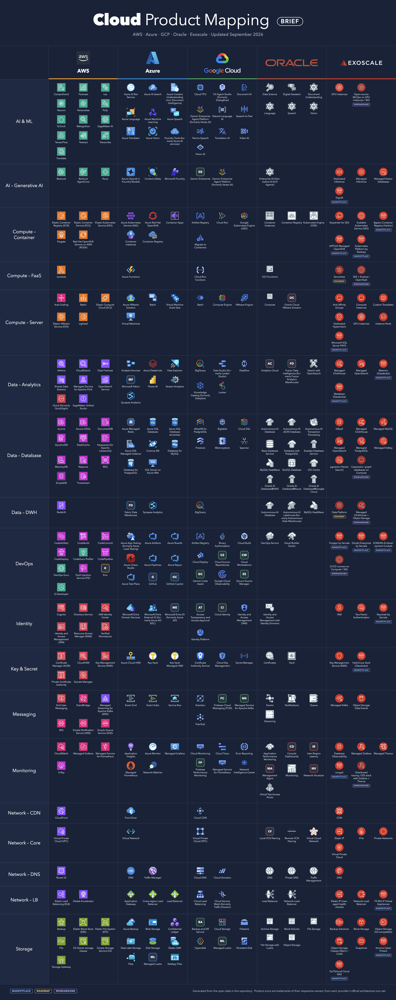

Download the full mapping: [PNG dark](CloudProductMapping.png) · [PNG light](CloudProductMapping-light.png) · [PDF dark](Cloud%20Product%20Mapping.pdf) · [PDF light](Cloud%20Product%20Mapping%20-%20light.pdf).
Brief version: [PNG dark](CloudProductMappingBrief.png) · [PNG light](CloudProductMappingBrief-light.png) · [PDF dark](Cloud%20Product%20Mapping%20-%20Brief.pdf) · [PDF light](Cloud%20Product%20Mapping%20-%20Brief%20-%20light.pdf).

The posters are generated from the same data ([`docs/poster.html`](docs/poster.html), [`docs/poster-brief.html`](docs/poster-brief.html)) using each provider's official architecture icons; re-export them with `python3 scripts/render.py` (needs Chromium or Chrome). Icons come from the official sets: [AWS Architecture Icons](https://aws.amazon.com/architecture/icons/), [Azure Architecture Icons](https://learn.microsoft.com/azure/architecture/icons/), [Google Cloud icons](https://cloud.google.com/icons), [OCI graphics for diagrams](https://docs.oracle.com/iaas/Content/General/Reference/graphicsfordiagrams.htm) (exported with `scripts/extract_oci_icons.py`) and the [Exoscale icon library](https://community.exoscale.com/tools/icon-table/). Provider logos come from [Wikimedia Commons](https://commons.wikimedia.org/wiki/File:Oracle_logo.svg) (Oracle), the [Exoscale press kit](https://www.exoscale.com/static/files/press-kit.zip), [cloud.google.com](https://cloud.google.com/icons) (Google Cloud) and the AWS and Azure icon sets. Icons and logos are trademarks of their respective owners. Categories shown in the brief version are flagged with `"brief": true` in [`data/categories.json`](data/categories.json).

## Bonus 1: Monitoring Cheat Sheet


Download the cheat sheet in the [PDF version](monitoring-cheat-sheat-dark.pdf), white background [PDF version](monitoring-cheat-sheat-light.pdf) or [PNG dark version](monitoring-cheat-sheet.png) or [PNG white version](monitoring-cheat-sheat-white.png).

## Bonus 2: Cloud Databases


Download the cheat sheet in the [PDF version](Cloud%20Databases.pdf) or [PNG version](Cloud-Databases.png).

## Give a Star! :star:

If you like or are using this project to learn or start your solution, please give it a star. Thanks!

<!-- MAPPING:START (generated by scripts/build.py, do not edit by hand) -->

## **AI & ML**

### **AWS**

[ Comprehend](https://aws.amazon.com/comprehend/) | [ Forecast](https://aws.amazon.com/forecast/) | [ Lex](https://aws.amazon.com/lex/) | [ Neuron](https://aws.amazon.com/ai/machine-learning/neuron/) | [ Personalize](https://aws.amazon.com/personalize/) | [ Polly](https://aws.amazon.com/polly/) | [ PyTorch](https://aws.amazon.com/pytorch/) | [ Rekognition](https://aws.amazon.com/rekognition/) | [ SageMaker AI](https://aws.amazon.com/sagemaker/ai/) | [ TensorFlow](https://aws.amazon.com/tensorflow/) | [ Textract](https://aws.amazon.com/textract/) | [ Transcribe](https://aws.amazon.com/transcribe/) | [ Translate](https://aws.amazon.com/translate/)

### **Azure**

[ Azure AI Bot Service](https://azure.microsoft.com/en-us/products/ai-services/ai-bot-service/) | [ Azure AI Search](https://azure.microsoft.com/en-us/products/ai-services/ai-search/) | [ Azure Content Understanding (incl. Document Intelligence)](https://azure.microsoft.com/en-us/products/ai-foundry/tools/content-understanding) | [ Azure Language](https://azure.microsoft.com/en-us/products/ai-foundry/tools/language) | [ Azure Machine Learning](https://azure.microsoft.com/en-us/products/machine-learning/) | [ Azure Speech](https://azure.microsoft.com/en-us/products/ai-foundry/tools/speech) | [ Azure Translator](https://azure.microsoft.com/en-us/products/ai-foundry/tools/translator) | [ Azure Vision](https://azure.microsoft.com/en-us/products/ai-foundry/tools/vision) | [ Foundry Tools (formerly Azure AI services)](https://azure.microsoft.com/en-us/products/ai-foundry/tools)

### **GCP**

[ Cloud TPU](https://cloud.google.com/tpu) | [ CX Agent Studio (formerly Dialogflow)](https://cloud.google.com/gemini-enterprise-cx/cx-agent-studio) | [ Document AI](https://cloud.google.com/document-ai) | [ Gemini Enterprise Agent Platform (formerly Vertex AI)](https://cloud.google.com/products/gemini-enterprise-agent-platform) | [ Natural Language AI](https://cloud.google.com/natural-language) | [ Speech-to-Text](https://cloud.google.com/speech-to-text) | [ Text-to-Speech](https://cloud.google.com/text-to-speech) | [ Translation AI](https://cloud.google.com/translate) | [ Video AI](https://cloud.google.com/video-intelligence) | [ Vision AI](https://cloud.google.com/vision)

### **Oracle**

[ Data Science](https://www.oracle.com/artificial-intelligence/data-science/) | [ Digital Assistant](https://www.oracle.com/chatbots/) | [ Document Understanding](https://www.oracle.com/artificial-intelligence/document-understanding/) | [ Language](https://www.oracle.com/artificial-intelligence/language/) | [ Speech](https://www.oracle.com/artificial-intelligence/speech/) | [ Vision](https://www.oracle.com/artificial-intelligence/vision/)

### **Exoscale**

[ GPU Instances](https://www.exoscale.com/gpu/) | [ Open-source MLOps on GPU Instances / SKS](https://www.exoscale.com/gpu/) _(Workaround)_


## **AI – Generative AI**

### **AWS**

[ Bedrock](https://aws.amazon.com/bedrock/) | [ Bedrock AgentCore](https://aws.amazon.com/bedrock/agentcore/) | [ Nova](https://aws.amazon.com/nova/)

### **Azure**

[ Azure OpenAI in Foundry Models](https://azure.microsoft.com/en-us/products/ai-foundry/models/openai/) | [ Content Safety](https://azure.microsoft.com/en-us/products/ai-services/ai-content-safety/) | [ Microsoft Foundry](https://azure.microsoft.com/en-us/products/ai-foundry/)

### **GCP**

[Gemini Enterprise](https://cloud.google.com/gemini-enterprise) | [ Gemini Enterprise Agent Platform (formerly Vertex AI)](https://cloud.google.com/products/gemini-enterprise-agent-platform)

### **Oracle**

[ Enterprise AI (Generative AI & AI Agents)](https://www.oracle.com/artificial-intelligence/enterprise-ai/)

### **Exoscale**

[ Dedicated Inference](https://www.exoscale.com/ai-cloud-infrastructure/dedicated-inference/) | [ Managed Inference](https://www.exoscale.com/ai-cloud-infrastructure/managed-inference/) | [ Managed Vector Databases](https://www.exoscale.com/dbaas/vector-databases/) | [ DigLM](https://www.exoscale.com/marketplace/listing/diglm/) _(Marketplace)_


## **Application – Mgmt**

### **AWS**

[ Amplify](https://aws.amazon.com/amplify/) | [ API Gateway](https://aws.amazon.com/api-gateway/) | [ App Runner](https://aws.amazon.com/apprunner/) | [ AppSync](https://aws.amazon.com/appsync/) | [ Elastic Beanstalk](https://aws.amazon.com/elasticbeanstalk/) | [ Serverless Application Repository](https://aws.amazon.com/serverless/serverlessrepo/)

### **Azure**

[ API Management](https://azure.microsoft.com/en-us/products/api-management/) | [ App Service](https://azure.microsoft.com/en-us/products/app-service/) | [ Azure Maps](https://azure.microsoft.com/en-us/products/azure-maps/) | [ Static Web Apps](https://azure.microsoft.com/en-us/products/app-service/static/)

### **GCP**

[ API Gateway](https://docs.cloud.google.com/api-gateway/docs) | [ Apigee](https://cloud.google.com/apigee) | [ App Engine](https://cloud.google.com/appengine) | [ Cloud APIs](https://cloud.google.com/apis)

### **Oracle**

[ APEX Application Development](https://www.oracle.com/application-development/apex/) | [ API Management (API Gateway)](https://www.oracle.com/cloud/cloud-native/api-management/) | [WebLogic Server for OCI](https://docs.oracle.com/en/cloud/paas/weblogic-cloud/index.html) | [WebLogic Server for OKE](https://docs.oracle.com/en/cloud/paas/weblogic-container/index.html)

### **Exoscale**

[ Open-source API gateway on SKS / Compute](https://www.exoscale.com/sks/) _(Workaround)_ | [ SKS + developer portal (App Runner / Beanstalk-style)](https://www.exoscale.com/sks/) _(Workaround)_


## **Application – Mobile**

### **AWS**

[ Amplify](https://aws.amazon.com/amplify/) | [ Device Farm](https://aws.amazon.com/device-farm/) | [Publisher Services](https://aps.amazon.com/aps/services/mobile-app-developers/)

### **Azure**

[ Notification Hubs](https://azure.microsoft.com/en-us/products/notification-hubs/)

### **GCP**

[AdMob and Firebase](https://firebase.google.com/docs/admob) | [Firebase](https://firebase.google.com/)

### **Oracle**

[ Visual Builder](https://www.oracle.com/application-development/visual-builder/)


## **Automation**

### **AWS**

[ Cloud Development Kit (CDK)](https://aws.amazon.com/cdk/) | [ CloudFormation](https://aws.amazon.com/cloudformation/) | [ Systems Manager](https://aws.amazon.com/systems-manager/)

### **Azure**

[ Automation](https://azure.microsoft.com/en-us/products/automation/) | [Bicep](https://learn.microsoft.com/en-us/azure/azure-resource-manager/bicep/overview)

### **GCP**

[ Infrastructure Manager](https://docs.cloud.google.com/infrastructure-manager/docs)

### **Oracle**

[OS Management Hub](https://www.oracle.com/cloud/compute/os-management/) | [ Resource Manager](https://www.oracle.com/cloud/cloud-native/resource-manager/)

### **Exoscale**

[ API](https://community.exoscale.com/reference/api/) | [ CLI (exo)](https://community.exoscale.com/tools/command-line-interface/) | [ Crossplane Provider](https://github.com/exoscale/provider-exoscale) | [ Packer Plugin](https://github.com/exoscale/packer-plugin-exoscale) | [ Pulumi Provider](https://www.pulumi.com/registry/packages/exoscale/) | [ SDKs (Go, Python)](https://www.exoscale.com/integration/) | [ Terraform Provider](https://registry.terraform.io/providers/exoscale/exoscale/latest)


## **Compliance**

### **AWS**

[ Artifact](https://aws.amazon.com/artifact/) | [ Audit Manager](https://aws.amazon.com/audit-manager/) | [Compliance Center](https://aws.amazon.com/financial-services/security-compliance/compliance-center/) | [ Config](https://aws.amazon.com/config/)

### **Azure**

[ Azure Policy](https://azure.microsoft.com/en-us/products/azure-policy/) | [ Microsoft Purview Compliance Manager](https://learn.microsoft.com/en-us/purview/compliance-manager) | [Trust Center](https://www.microsoft.com/en-us/trust-center)

### **GCP**

[ Assured Workloads](https://cloud.google.com/security/products/assured-workloads) | [Compliance Reports Manager](https://cloud.google.com/security/compliance/compliance-reports-manager)

### **Oracle**

[ OCI Cloud Guard](https://www.oracle.com/security/cloud-security/cloud-guard/) | [ Security Zones](https://www.oracle.com/security/cloud-security/security-zones/)

### **Exoscale**

[ Compliance Certifications](https://www.exoscale.com/compliance/) | [ Health Data Hosting (HDS)](https://www.exoscale.com/compliance/hds/) | [ Shared Responsibility Model](https://www.exoscale.com/security/) | [ 360vue Compliance Platform](https://www.exoscale.com/marketplace/listing/360vue-compliance-platform/) _(Marketplace)_ | [ RegData Protection Suite](https://www.exoscale.com/marketplace/listing/regdata-data-protection/) _(Marketplace)_


## **Compute – Container**

### **AWS**

[ Elastic Container Registry (ECR)](https://aws.amazon.com/ecr/) | [ Elastic Container Service (ECS)](https://aws.amazon.com/ecs/) | [ Elastic Kubernetes Service (EKS)](https://aws.amazon.com/eks/) | [ Fargate](https://aws.amazon.com/fargate/) | [ Red Hat OpenShift Service on AWS (ROSA)](https://aws.amazon.com/rosa/)

### **Azure**

[ Azure Kubernetes Service (AKS)](https://azure.microsoft.com/en-us/products/kubernetes-service/) | [ Azure Red Hat OpenShift](https://azure.microsoft.com/en-us/products/openshift/) | [ Container Apps](https://azure.microsoft.com/en-us/products/container-apps/) | [ Container Instances](https://azure.microsoft.com/en-us/products/container-instances/) | [ Container Registry](https://azure.microsoft.com/en-us/products/container-registry/)

### **GCP**

[ Artifact Registry](https://docs.cloud.google.com/artifact-registry/docs) | [ Cloud Run](https://cloud.google.com/run) | [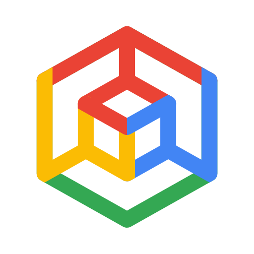 Google Kubernetes Engine (GKE)](https://cloud.google.com/kubernetes-engine) | [ Migrate to Containers](https://cloud.google.com/products/cloud-migration/containers)

### **Oracle**

[ Container Instances](https://www.oracle.com/cloud/cloud-native/container-instances/) | [ Container Registry](https://www.oracle.com/cloud/cloud-native/container-registry/) | [ Kubernetes Engine (OKE)](https://www.oracle.com/cloud/cloud-native/kubernetes-engine/)

### **Exoscale**

[ Karpenter for SKS](https://www.exoscale.com/sks/karpenter/) | [ Scalable Kubernetes Service (SKS)](https://www.exoscale.com/sks/) | [ 8gears Container Registry (Harbor)](https://www.exoscale.com/marketplace/listing/container-registry/) _(Marketplace)_ | [ APPUiO Managed OpenShift](https://www.exoscale.com/marketplace/listing/appuio-container-platform/) _(Marketplace)_ | [ Kubernetes Platform by Elastisys](https://www.exoscale.com/marketplace/listing/compliant-kubernetes-by-elastisys/) _(Marketplace)_


## **Compute – FaaS**

### **AWS**

[ Lambda](https://aws.amazon.com/lambda/)

### **Azure**

[ Azure Functions](https://azure.microsoft.com/en-us/products/functions/)

### **GCP**

[ Cloud Run functions](https://cloud.google.com/functions)

### **Oracle**

[ OCI Functions](https://www.oracle.com/cloud/cloud-native/functions/)

### **Exoscale**

 Serverless _(Roadmap)_ | [ SKS + Knative / OpenFaaS](https://www.exoscale.com/sks/) _(Workaround)_


## **Compute – Server**

### **AWS**

[ Auto Scaling](https://aws.amazon.com/autoscaling/) | [ Batch](https://aws.amazon.com/batch/) | [ Elastic Compute Cloud (EC2)](https://aws.amazon.com/ec2/) | [ Elastic VMware Service (EVS)](https://aws.amazon.com/evs/) | [ Lightsail](https://aws.amazon.com/lightsail/)

### **Azure**

[ Azure VMware Solution](https://azure.microsoft.com/en-us/products/azure-vmware/) | [ Batch](https://azure.microsoft.com/en-us/products/batch/) | [ Virtual Machine Scale Sets](https://azure.microsoft.com/en-us/products/virtual-machine-scale-sets/) | [ Virtual Machines](https://azure.microsoft.com/en-us/products/virtual-machines/)

### **GCP**

[ Batch](https://cloud.google.com/batch) | [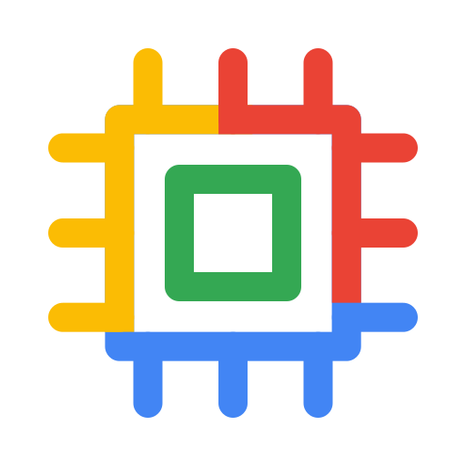 Compute Engine](https://cloud.google.com/products/compute) | [ VMware Engine](https://cloud.google.com/vmware-engine)

### **Oracle**

[ Compute](https://www.oracle.com/cloud/compute/) | [Oracle Cloud VMware Solution](https://www.oracle.com/cloud/compute/vmware/)

### **Exoscale**

[ Anti-Affinity Groups](https://community.exoscale.com/product/compute/instances/how-to/anti-affinity/) | [ Compute Instances](https://www.exoscale.com/compute/) | [ Custom Templates](https://www.exoscale.com/templates/) | [ Dedicated Hypervisors](https://community.exoscale.com/product/compute/dedicated-hypervisors/) | [ GPU Instances](https://www.exoscale.com/gpu/) | [ Instance Pools](https://community.exoscale.com/product/compute/instances/how-to/instance-pools/) | [ Microsoft SQL Server PAYG](https://www.exoscale.com/marketplace/listing/microsoft-sql-server-payg/) _(Marketplace)_


## **Cost**

### **AWS**

[ Billing](https://aws.amazon.com/aws-cost-management/aws-billing/) | [ Budgets](https://aws.amazon.com/aws-cost-management/aws-budgets/) | [ Cost Anomaly Detection](https://aws.amazon.com/aws-cost-management/aws-cost-anomaly-detection/) | [ Cost Categories](https://aws.amazon.com/aws-cost-management/aws-cost-categories/) | [ Cost Explorer](https://aws.amazon.com/aws-cost-management/aws-cost-explorer/) | [ Pricing Calculator](https://calculator.aws/#/) | [ Savings Plans](https://aws.amazon.com/savingsplans/)

### **Azure**

[ Advisor](https://azure.microsoft.com/en-us/products/advisor/) | [ Cost Management and Billing](https://azure.microsoft.com/en-us/products/cost-management/) | [Pricing Calculator](https://azure.microsoft.com/en-us/pricing/calculator/)

### **GCP**

[Active Assist (Recommender)](https://docs.cloud.google.com/recommender/docs/whatis-activeassist) | [ Cost Management](https://cloud.google.com/cost-management) | [Pricing Calculator](https://cloud.google.com/products/calculator)

### **Oracle**

[Budgets](https://docs.oracle.com/en-us/iaas/Content/Billing/Concepts/budgetsoverview.htm) | [Cost Analysis](https://docs.oracle.com/en-us/iaas/Content/Billing/Concepts/costanalysisoverview.htm) | [Cost Estimator](https://www.oracle.com/cloud/costestimator.html) | [Oracle Support Rewards](https://www.oracle.com/cloud/rewards/)

### **Exoscale**

[ Pricing](https://www.exoscale.com/pricing/) | [ Pricing Calculator](https://www.exoscale.com/calculator/) | [ Volume Discount](https://www.exoscale.com/pricing/volume-discount/)


## **Data – Analytics**

### **AWS**

[ Athena](https://aws.amazon.com/athena/) | [ CloudSearch](https://aws.amazon.com/cloudsearch/) | [ Data Firehose](https://aws.amazon.com/firehose/) | [ Kinesis Data Streams](https://aws.amazon.com/kinesis/data-streams/) | [ Managed Service for Apache Flink](https://aws.amazon.com/managed-service-apache-flink/) | [ OpenSearch Service](https://aws.amazon.com/opensearch-service/) | [ Quick (formerly QuickSight)](https://aws.amazon.com/quick/) | [ SageMaker Unified Studio](https://aws.amazon.com/sagemaker/unified-studio/)

### **Azure**

[ Analysis Services](https://azure.microsoft.com/en-us/products/analysis-services/) | [ Azure Databricks](https://azure.microsoft.com/en-us/products/databricks/) | [ Data Explorer](https://azure.microsoft.com/en-us/products/data-explorer/) | [Microsoft Fabric](https://www.microsoft.com/en-us/microsoft-fabric) | [ Power BI](https://www.microsoft.com/en-us/power-platform/products/power-bi) | [ Stream Analytics](https://azure.microsoft.com/en-us/products/stream-analytics/) | [ Synapse Analytics](https://azure.microsoft.com/en-us/products/synapse-analytics/)

### **GCP**

[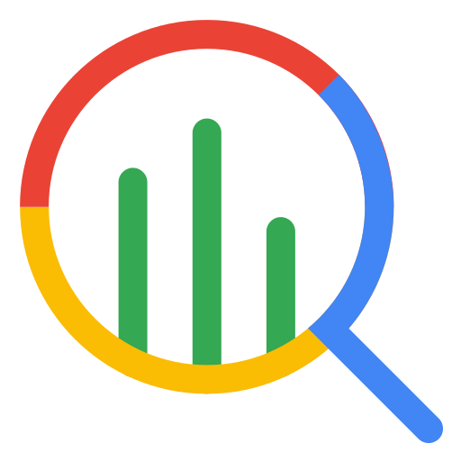 BigQuery](https://cloud.google.com/bigquery) | [ Data Studio (formerly Looker Studio)](https://cloud.google.com/data-studio) | [ Dataflow](https://cloud.google.com/products/dataflow) | [ Knowledge Catalog (formerly Dataplex)](https://cloud.google.com/products/knowledge-catalog) | [ Looker](https://cloud.google.com/looker)

### **Oracle**

[Analytics Cloud](https://www.oracle.com/analytics/) | [Fusion Data Intelligence (formerly Fusion Analytics Warehouse)](https://www.oracle.com/fusion-data-intelligence/) | [ Search with OpenSearch](https://www.oracle.com/cloud/search/)

### **Exoscale**

[ Managed ClickHouse](https://www.exoscale.com/dbaas/clickhouse/) | [ Managed OpenSearch](https://www.exoscale.com/dbaas/opensearch/) | [ Matomo (Glasskube)](https://www.exoscale.com/marketplace/listing/glasskube-matomo/) _(Marketplace)_ | [ Metabase (Glasskube)](https://www.exoscale.com/marketplace/listing/glasskube-metabase/) _(Marketplace)_


## **Data – Big Data**

### **AWS**

[ EMR](https://aws.amazon.com/emr/)

### **Azure**

[ HDInsight](https://azure.microsoft.com/en-us/products/hdinsight/)

### **GCP**

[ Managed Service for Apache Spark (formerly Dataproc)](https://cloud.google.com/products/managed-service-for-apache-spark)

### **Oracle**

[ Big Data Service](https://www.oracle.com/big-data/big-data-service/) | [ Data Flow](https://www.oracle.com/big-data/data-flow/)

### **Exoscale**

 Data Platform _(Roadmap)_ | [ Spark on SKS](https://www.exoscale.com/sks/) _(Workaround)_


## **Data – Database**

### **AWS**

[ Aurora](https://aws.amazon.com/rds/aurora/) | [ Aurora DSQL](https://aws.amazon.com/rds/aurora/dsql/) | [ DocumentDB](https://aws.amazon.com/documentdb/) | [ DynamoDB](https://aws.amazon.com/dynamodb/) | [ ElastiCache](https://aws.amazon.com/elasticache/) | [ Keyspaces (for Apache Cassandra)](https://aws.amazon.com/keyspaces/) | [ MemoryDB](https://aws.amazon.com/memorydb/) | [ Neptune](https://aws.amazon.com/neptune/) | [ RDS](https://aws.amazon.com/rds/) | [ SimpleDB](https://aws.amazon.com/simpledb/) | [ Timestream](https://aws.amazon.com/timestream/)

### **Azure**

[ Azure Managed Redis](https://azure.microsoft.com/en-us/products/managed-redis/) | [ Azure SQL Database](https://azure.microsoft.com/en-us/products/azure-sql/database/) | [ Azure SQL Database serverless](https://learn.microsoft.com/en-us/azure/azure-sql/database/serverless-tier-overview) | [ Azure SQL Managed Instance](https://azure.microsoft.com/en-us/products/azure-sql/managed-instance/) | [ Cosmos DB](https://azure.microsoft.com/en-us/products/cosmos-db/) | [ Database for MySQL](https://azure.microsoft.com/en-us/products/mysql/) | [ Database for PostgreSQL](https://azure.microsoft.com/en-us/products/postgresql/) | [ SQL Server on Azure VMs](https://azure.microsoft.com/en-us/products/virtual-machines/sql-server/)

### **GCP**

[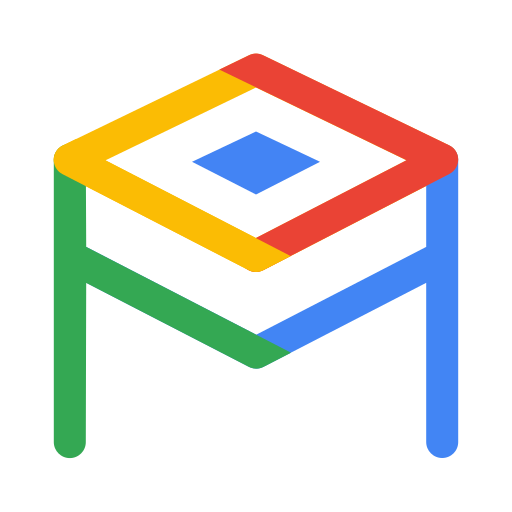 AlloyDB for PostgreSQL](https://cloud.google.com/products/alloydb) | [ Bigtable](https://cloud.google.com/bigtable) | [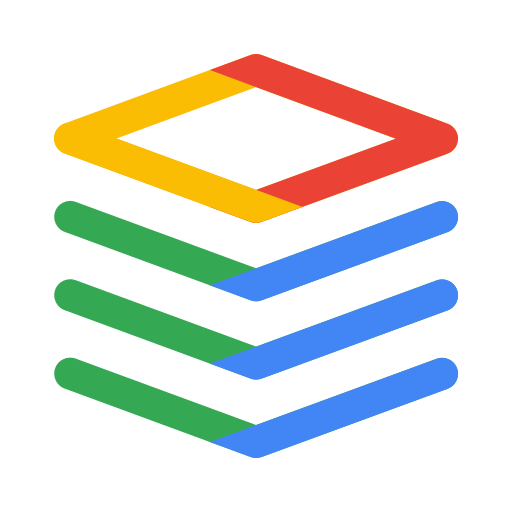 Cloud SQL](https://cloud.google.com/sql) | [ Firestore](https://cloud.google.com/products/firestore) | [ Memorystore](https://cloud.google.com/memorystore) | [ Spanner](https://cloud.google.com/spanner)

### **Oracle**

[ Autonomous AI Database](https://www.oracle.com/autonomous-database/) | [ Autonomous AI JSON Database](https://www.oracle.com/autonomous-database/autonomous-json-database/) | [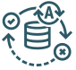 Autonomous AI Transaction Processing](https://www.oracle.com/autonomous-database/autonomous-transaction-processing/) | [ Base Database Service](https://www.oracle.com/database/base-database-service/) | [ Database with PostgreSQL](https://www.oracle.com/cloud/postgresql/) | [ Exadata Database Service](https://www.oracle.com/engineered-systems/exadata/database-service/) | [ MySQL HeatWave](https://www.oracle.com/mysql/) | [ NoSQL Database](https://www.oracle.com/database/nosql/) | [ OCI Cache](https://www.oracle.com/cloud/cache/) | [ Oracle AI Database@AWS](https://www.oracle.com/cloud/aws/) | [ Oracle AI Database@Azure](https://www.oracle.com/cloud/azure/oracle-database-at-azure/) | [ Oracle AI Database@Google Cloud](https://www.oracle.com/cloud/google/oracle-database-at-google-cloud/)

### **Exoscale**

[ DBaaS](https://www.exoscale.com/dbaas/) | [ Managed ClickHouse](https://www.exoscale.com/dbaas/clickhouse/) | [ Managed MySQL](https://www.exoscale.com/dbaas/mysql/) | [ Managed OpenSearch](https://www.exoscale.com/dbaas/opensearch/) | [ Managed PostgreSQL](https://www.exoscale.com/dbaas/postgresql/) | [ Managed Valkey](https://www.exoscale.com/dbaas/valkey/) | [ pgvector (Vector Search)](https://www.exoscale.com/dbaas/pgvector/) | [ Cassandra / graph databases on Compute](https://www.exoscale.com/compute/) _(Workaround)_


## **Data – Data Lake**

### **AWS**

[ Data Lakes on AWS (S3)](https://aws.amazon.com/big-data/datalakes-and-analytics/datalakes/) | [ Lake Formation](https://aws.amazon.com/lake-formation/) | [ S3 Tables](https://aws.amazon.com/s3/features/tables/)

### **Azure**

[ Data Lake Storage](https://azure.microsoft.com/en-us/products/storage/data-lake-storage/) | [OneLake (Microsoft Fabric)](https://learn.microsoft.com/en-us/fabric/onelake/onelake-overview)

### **GCP**

[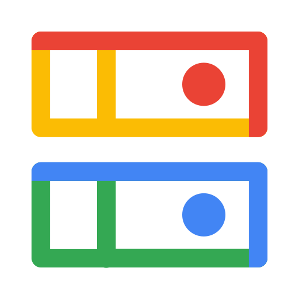 Cloud Storage](https://cloud.google.com/storage) | [Data Lakehouse Solution](https://cloud.google.com/solutions/data-lakehouse) | [Lakehouse for Apache Iceberg (BigLake)](https://cloud.google.com/products/lakehouse)

### **Oracle**

[ Autonomous AI Lakehouse](https://www.oracle.com/autonomous-database/autonomous-ai-lakehouse/) | [ MySQL HeatWave Lakehouse](https://www.oracle.com/mysql/lakehouse/)

### **Exoscale**

 Data Platform _(Roadmap)_ | [ Object Storage + open-source lakehouse tooling](https://www.exoscale.com/object-storage/) _(Workaround)_


## **Data – DWH**

### **AWS**

[ Redshift](https://aws.amazon.com/redshift/)

### **Azure**

[Fabric Data Warehouse](https://learn.microsoft.com/en-us/fabric/data-warehouse/data-warehousing) | [ Synapse Analytics](https://azure.microsoft.com/en-us/products/synapse-analytics/)

### **GCP**

[ BigQuery](https://cloud.google.com/bigquery)

### **Oracle**

[ Autonomous AI Database](https://www.oracle.com/autonomous-database/) | [ Autonomous AI Lakehouse (formerly Autonomous Data Warehouse)](https://www.oracle.com/autonomous-database/autonomous-ai-lakehouse/) | [ MySQL HeatWave](https://www.oracle.com/mysql/)

### **Exoscale**

 Data Platform _(Roadmap)_ | [ Managed ClickHouse + Object Storage](https://www.exoscale.com/dbaas/clickhouse/) _(Workaround)_


## **DevOps**

### **AWS**

[ CodeArtifact](https://aws.amazon.com/codeartifact/) | [ CodeBuild](https://aws.amazon.com/codebuild/) | [ CodeCommit](https://aws.amazon.com/codecommit/) | [ CodeDeploy](https://aws.amazon.com/codedeploy/) | [ CodeGuru Profiler](https://aws.amazon.com/codeguru/profiler/) | [ CodePipeline](https://aws.amazon.com/codepipeline/) | [ DevOps Guru](https://aws.amazon.com/devops-guru/) | [ Fault Injection Service (FIS)](https://aws.amazon.com/fis/) | [Kiro](https://kiro.dev/) | [ Q Developer](https://aws.amazon.com/q/developer/)

### **Azure**

[ Azure App Testing (formerly Azure Load Testing)](https://azure.microsoft.com/en-us/products/app-testing/) | [ Azure Artifacts](https://azure.microsoft.com/en-us/products/devops/artifacts/) | [ Azure Boards](https://azure.microsoft.com/en-us/products/devops/boards/) | [ Azure Chaos Studio](https://azure.microsoft.com/en-us/products/chaos-studio/) | [ Azure Pipelines](https://azure.microsoft.com/en-us/products/devops/pipelines/) | [ Azure Repos](https://azure.microsoft.com/en-us/products/devops/repos/) | [ Azure Test Plans](https://azure.microsoft.com/en-us/products/devops/test-plans/) | [GitHub](https://github.com/) | [GitHub Copilot](https://github.com/features/copilot)

### **GCP**

[ Artifact Registry](https://docs.cloud.google.com/artifact-registry/docs) | [ Binary Authorization](https://docs.cloud.google.com/binary-authorization/docs) | [ Cloud Build](https://cloud.google.com/build) | [ Cloud Deploy](https://cloud.google.com/deploy) | [Cloud Source Repositories](https://docs.cloud.google.com/source-repositories/docs) | [Cloud Workstations](https://cloud.google.com/workstations) | [Gemini Code Assist](https://codeassist.google/) | [ Google Cloud Observability](https://cloud.google.com/products/observability) | [Secure Source Manager](https://cloud.google.com/products/secure-source-manager)

### **Oracle**

[ DevOps Service](https://www.oracle.com/cloud/cloud-native/devops-service/) | [ Visual Builder Studio](https://www.oracle.com/application-development/visual-builder-studio/)

### **Exoscale**

[ Forgejo by Servala](https://www.exoscale.com/marketplace/listing/forgejo-by-servala/) _(Marketplace)_ | [ GitLab Enterprise by Servala](https://www.exoscale.com/marketplace/listing/gitlab-by-servala/) _(Marketplace)_ | [ SOKKAN AI-development Cockpit](https://www.exoscale.com/marketplace/listing/sokkan/) _(Marketplace)_ | [ CI/CD runners on Compute / SKS](https://www.exoscale.com/sks/) _(Workaround)_


## **Email**

### **AWS**

[ Simple Email Service (SES)](https://aws.amazon.com/ses/)

### **Azure**

[ Communication Services (Email)](https://azure.microsoft.com/en-us/products/communication-services/) | [Microsoft 365](https://www.microsoft.com/en-us/microsoft-365)

### **GCP**

[Gmail (Google Workspace)](https://workspace.google.com/products/gmail/)

### **Oracle**

[ Email Delivery](https://docs.oracle.com/en-us/iaas/Content/Email/Concepts/overview.htm)


## **ETL**

### **AWS**

[ AppFlow](https://aws.amazon.com/appflow/) | [ Glue](https://aws.amazon.com/glue/)

### **Azure**

[ Data Factory](https://azure.microsoft.com/en-us/products/data-factory/) | [Microsoft Purview](https://www.microsoft.com/en-us/security/business/microsoft-purview)

### **GCP**

[ Cloud Data Fusion](https://cloud.google.com/data-fusion) | [ Datastream](https://cloud.google.com/datastream)

### **Oracle**

[ Data Integration](https://www.oracle.com/integration/data-integration/) | [ GoldenGate](https://www.oracle.com/integration/goldengate/) | [ Oracle Integration](https://www.oracle.com/integration/application-integration/)

### **Exoscale**

 Data Platform _(Roadmap)_ | [ Open-source ETL tooling on SKS / Compute](https://www.exoscale.com/sks/) _(Workaround)_


## **Firewall**

### **AWS**

[ Firewall Manager](https://aws.amazon.com/firewall-manager/) | [ Network Firewall](https://aws.amazon.com/network-firewall/) | [ Web Application Firewall (WAF)](https://aws.amazon.com/waf/)

### **Azure**

[ Azure Firewall](https://azure.microsoft.com/en-us/products/azure-firewall/) | [ Firewall Manager](https://azure.microsoft.com/en-us/products/firewall-manager/) | [ Web Application Firewall](https://azure.microsoft.com/en-us/products/web-application-firewall/)

### **GCP**

[ Cloud Armor](https://cloud.google.com/security/products/armor) | [ Cloud Firewall (Cloud NGFW)](https://cloud.google.com/security/products/firewall)

### **Oracle**

[ Network Firewall](https://www.oracle.com/cloud/networking/network-firewall/) | [ OCI Web Application Firewall](https://www.oracle.com/security/cloud-security/web-application-firewall/)

### **Exoscale**

[ Security Groups](https://community.exoscale.com/product/networking/security-group/) | [ BunkerWeb WAF](https://www.exoscale.com/marketplace/listing/bunkerweb-community/) _(Marketplace)_ | [ Check Point CloudGuard](https://www.exoscale.com/marketplace/listing/check-point-cloudguard-iaas-byol/) _(Marketplace)_ | [ FortiGate Virtual Appliances](https://www.exoscale.com/marketplace/listing/fortigate-virtual-appliances-byol/) _(Marketplace)_ | [ IPFire](https://www.exoscale.com/marketplace/listing/lwl-ipfire-open-source-firewall-payg/) _(Marketplace)_


## **Hybrid**

### **AWS**

[ ECS Anywhere](https://aws.amazon.com/ecs/anywhere/) | [ EKS Anywhere](https://aws.amazon.com/eks/eks-anywhere/) | [ Local Zones](https://aws.amazon.com/about-aws/global-infrastructure/localzones/) | [ Outposts](https://aws.amazon.com/outposts/) | [ Wavelength](https://aws.amazon.com/wavelength/)

### **Azure**

[ Azure Arc](https://azure.microsoft.com/en-us/products/azure-arc/) | [ Azure Local (formerly Azure Stack HCI)](https://azure.microsoft.com/en-us/products/local/) | [Azure Stack Edge](https://azure.microsoft.com/en-us/products/azure-stack/edge/) | [Azure Stack Hub](https://azure.microsoft.com/en-us/products/azure-stack/hub/)

### **GCP**

[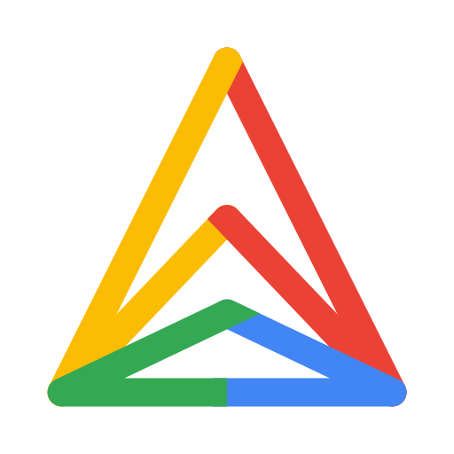 GKE Multi-Cloud (formerly Anthos)](https://docs.cloud.google.com/kubernetes-engine/multi-cloud/docs) | [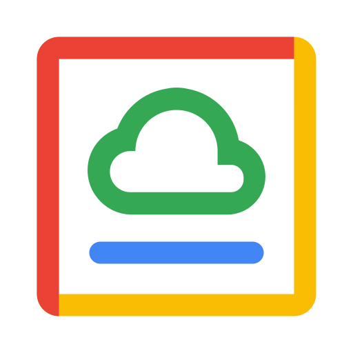 Google Distributed Cloud](https://cloud.google.com/distributed-cloud)

### **Oracle**

[Cloud@Customer](https://www.oracle.com/cloud/cloud-at-customer/) | [ Dedicated Region Cloud@Customer](https://www.oracle.com/cloud/cloud-at-customer/dedicated-region/) | [ Exadata Cloud@Customer](https://www.oracle.com/engineered-systems/exadata/cloud-at-customer/) | [ Roving Edge Infrastructure](https://docs.oracle.com/en-us/iaas/Content/Rover/overview.htm)

### **Exoscale**

[ Dedicated Hypervisors](https://community.exoscale.com/product/compute/dedicated-hypervisors/) | [ Exoscale EDGE](https://www.exoscale.com/edge/) | [ Private Connect](https://community.exoscale.com/product/networking/private-connect/) | [ Virtual Private Cloud](https://www.exoscale.com/virtual-private-cloud/)


## **Identity**

### **AWS**

[ Cognito](https://aws.amazon.com/cognito/) | [ Directory Service](https://aws.amazon.com/directoryservice/) | [ IAM Identity Center](https://aws.amazon.com/iam/identity-center/) | [ Identity and Access Management (IAM)](https://aws.amazon.com/iam/) | [ Resource Access Manager (RAM)](https://aws.amazon.com/ram/) | [ Verified Permissions](https://aws.amazon.com/verified-permissions/)

### **Azure**

[ Microsoft Entra Domain Services](https://learn.microsoft.com/en-us/entra/identity/domain-services/overview) | [ Microsoft Entra External ID (formerly Azure AD B2C)](https://www.microsoft.com/en-us/security/business/identity-access/microsoft-entra-external-id) | [Microsoft Entra ID (formerly Azure AD)](https://www.microsoft.com/en-us/security/business/identity-access/microsoft-entra-id)

### **GCP**

[Access Transparency and Access Approval](https://cloud.google.com/security/products/access-transparency) | [Cloud Identity](https://docs.cloud.google.com/identity/docs) | [ Identity and Access Management (IAM)](https://docs.cloud.google.com/iam/docs) | [ Identity Platform](https://docs.cloud.google.com/identity-platform/docs)

### **Oracle**

[ Identity and Access Management with Identity Domains](https://docs.oracle.com/en-us/iaas/Content/Identity/home.htm)

### **Exoscale**

[ IAM](https://community.exoscale.com/product/security/iam/) | [ Two-Factor Authentication](https://www.exoscale.com/virtual-private-cloud/) | [ Keycloak by Servala](https://www.exoscale.com/marketplace/listing/keycloak-by-servala/) _(Marketplace)_


## **IoT**

### **AWS**

[ IoT Core](https://aws.amazon.com/iot-core/) | [ IoT Device Management](https://aws.amazon.com/iot-device-management/) | [ IoT Greengrass](https://aws.amazon.com/greengrass/) | [ IoT SiteWise](https://aws.amazon.com/iot-sitewise/)

### **Azure**

[ Azure IoT Operations](https://azure.microsoft.com/en-us/products/iot-operations/) | [ Digital Twins](https://azure.microsoft.com/en-us/products/digital-twins/) | [ IoT Edge](https://azure.microsoft.com/en-us/products/iot-edge/) | [ IoT Hub](https://azure.microsoft.com/en-us/products/iot-hub/)

### **Oracle**

[IoT Platform](https://www.oracle.com/cloud/cloud-native/iot-platform/)

### **Exoscale**

[ Self-hosted MQTT broker on SKS / Compute](https://www.exoscale.com/sks/) _(Workaround)_


## **Key & Secret**

### **AWS**

[ Certificate Manager (ACM)](https://aws.amazon.com/certificate-manager/) | [ CloudHSM](https://aws.amazon.com/cloudhsm/) | [ Key Management Service (KMS)](https://aws.amazon.com/kms/) | [ Private Certificate Authority](https://aws.amazon.com/private-ca/) | [ Secrets Manager](https://aws.amazon.com/secrets-manager/)

### **Azure**

[ Azure Cloud HSM](https://learn.microsoft.com/en-us/azure/cloud-hsm/overview) | [ Key Vault](https://azure.microsoft.com/en-us/products/key-vault/) | [ Key Vault Managed HSM](https://learn.microsoft.com/en-us/azure/key-vault/managed-hsm/overview)

### **GCP**

[ Certificate Authority Service](https://cloud.google.com/security/products/certificate-authority-service) | [ Cloud Key Management](https://cloud.google.com/security/products/security-key-management) | [ Secret Manager](https://cloud.google.com/security/products/secret-manager)

### **Oracle**

[ Certificates](https://docs.oracle.com/en-us/iaas/Content/certificates/home.htm) | [ Vault](https://www.oracle.com/security/cloud-security/key-management/)

### **Exoscale**

[ Key Management Service (KMS)](https://community.exoscale.com/product/security/kms/) | [ HashiCorp Vault (Glasskube)](https://www.exoscale.com/marketplace/listing/glasskube-vault/) _(Marketplace)_


## **Logging**

### **AWS**

[ CloudTrail](https://aws.amazon.com/cloudtrail/) | [ CloudWatch Logs](https://docs.aws.amazon.com/AmazonCloudWatch/latest/logs/WhatIsCloudWatchLogs.html)

### **Azure**

[ Activity Log](https://learn.microsoft.com/en-us/azure/azure-monitor/platform/activity-log) | [ Azure Monitor Logs](https://learn.microsoft.com/en-us/azure/azure-monitor/logs/data-platform-logs) | [Microsoft Entra Audit Logs](https://learn.microsoft.com/en-us/entra/identity/monitoring-health/concept-audit-logs) | [ Resource Logs](https://learn.microsoft.com/en-us/azure/azure-monitor/platform/resource-logs)

### **GCP**

[ Cloud Audit Logs](https://docs.cloud.google.com/logging/docs/audit) | [ Cloud Logging](https://cloud.google.com/logging)

### **Oracle**

[ Audit](https://docs.oracle.com/en-us/iaas/Content/Audit/Concepts/auditoverview.htm) | [ Log Analytics](https://www.oracle.com/manageability/log-analytics/) | [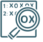 Logging](https://www.oracle.com/application-development/logging/)

### **Exoscale**

[ Audit Trail](https://community.exoscale.com/platform/audit-trail/) | [ Managed OpenSearch](https://www.exoscale.com/dbaas/opensearch/) | [ SKS Kubernetes Audit](https://community.exoscale.com/product/compute/containers/how-to/kubernetes-audit/)


## **Messaging**

### **AWS**

[ End User Messaging](https://aws.amazon.com/end-user-messaging/) | [ EventBridge](https://aws.amazon.com/eventbridge/) | [ Managed Streaming for Apache Kafka (MSK)](https://aws.amazon.com/msk/) | [ MQ](https://aws.amazon.com/amazon-mq/) | [ Simple Notification Service (SNS)](https://aws.amazon.com/sns/) | [ Simple Queue Service (SQS)](https://aws.amazon.com/sqs/)

### **Azure**

[ Event Grid](https://azure.microsoft.com/en-us/products/event-grid/) | [ Event Hubs](https://azure.microsoft.com/en-us/products/event-hubs/) | [ Service Bus](https://azure.microsoft.com/en-us/products/service-bus/)

### **GCP**

[ Eventarc](https://docs.cloud.google.com/eventarc/docs) | [Firebase Cloud Messaging (FCM)](https://firebase.google.com/docs/cloud-messaging/) | [Managed Service for Apache Kafka](https://cloud.google.com/products/managed-service-for-apache-kafka) | [ Pub/Sub](https://cloud.google.com/pubsub)

### **Oracle**

[ Events](https://www.oracle.com/cloud/events-service/) | [ Notifications](https://www.oracle.com/cloud/cloud-native/notifications/) | [ Queue](https://www.oracle.com/cloud/queue/) | [ Streaming](https://www.oracle.com/cloud/streaming/)

### **Exoscale**

[ Managed Kafka](https://www.exoscale.com/dbaas/kafka/) | [ Object Storage Data Events](https://community.exoscale.com/product/storage/object-storage/how-to/data-events/)


## **Migration**

### **AWS**

[ Application Migration Service](https://aws.amazon.com/application-migration-service/) | [ Data Transfer Terminal](https://aws.amazon.com/data-transfer-terminal/) | [ Database Migration Service (DMS)](https://aws.amazon.com/dms/) | [ DataSync](https://aws.amazon.com/datasync/) | [ Snowball Edge](https://aws.amazon.com/snowball/) | [ Transfer Family](https://aws.amazon.com/aws-transfer-family/) | [ Transform](https://aws.amazon.com/transform/)

### **Azure**

[ Azure Migrate](https://azure.microsoft.com/en-us/products/azure-migrate/) | [ Data Box](https://azure.microsoft.com/en-us/products/databox/) | [ Database Migration Service](https://azure.microsoft.com/en-us/products/database-migration/) | [ File Sync](https://learn.microsoft.com/en-us/azure/storage/file-sync/file-sync-introduction) | [ Import/Export](https://learn.microsoft.com/en-us/azure/import-export/storage-import-export-service)

### **GCP**

[ Database Migration Service](https://cloud.google.com/database-migration) | [ Migrate to Virtual Machines](https://cloud.google.com/products/cloud-migration/virtual-machines) | [Migration Center](https://docs.cloud.google.com/migration-center/docs) | [ Storage Transfer Service](https://cloud.google.com/storage-transfer-service) | [ Transfer Appliance](https://docs.cloud.google.com/transfer-appliance/docs/4.0/overview)

### **Oracle**

[ Data Transfer (Roving Edge Infrastructure)](https://docs.oracle.com/en-us/iaas/Content/Rover/overview.htm) | [Database Migration Service](https://www.oracle.com/database/cloud-migration/) | [Oracle Cloud Migrations](https://docs.oracle.com/en-us/iaas/Content/cloud-migration/home.htm) | [Zero Downtime Migration](https://www.oracle.com/database/zero-downtime-migration/)

### **Exoscale**

[ DBaaS Migration (PostgreSQL, MySQL, Valkey)](https://community.exoscale.com/product/dbaas/service-specific/postgresql/how-to/postgresql-migration/) | [ Custom Templates (VM image import)](https://community.exoscale.com/product/compute/instances/how-to/custom-templates/) _(Workaround)_ | [ S3-compatible transfer tools (rclone, AWS CLI)](https://community.exoscale.com/product/storage/object-storage/how-to/awscli/) _(Workaround)_


## **Monitoring**

### **AWS**

[ CloudWatch](https://aws.amazon.com/cloudwatch/) | [ Managed Grafana](https://aws.amazon.com/grafana/) | [ Managed Service for Prometheus](https://aws.amazon.com/prometheus/) | [ X-Ray](https://docs.aws.amazon.com/xray/latest/devguide/aws-xray.html)

### **Azure**

[ Application Insights](https://learn.microsoft.com/en-us/azure/azure-monitor/app/app-insights-overview) | [ Azure Monitor](https://azure.microsoft.com/en-us/products/monitor/) | [ Managed Grafana](https://azure.microsoft.com/en-us/products/managed-grafana/) | [ Managed Prometheus](https://learn.microsoft.com/en-us/azure/azure-monitor/metrics/prometheus-metrics-overview) | [ Network Watcher](https://azure.microsoft.com/en-us/products/network-watcher/)

### **GCP**

[ Cloud Monitoring](https://cloud.google.com/monitoring) | [ Cloud Trace](https://docs.cloud.google.com/trace/docs) | [ Error Reporting](https://docs.cloud.google.com/error-reporting/docs/grouping-errors) | [Firebase Performance Monitoring](https://firebase.google.com/docs/perf-mon) | [ Managed Service for Prometheus](https://cloud.google.com/managed-prometheus) | [ Network Intelligence Center](https://cloud.google.com/network-intelligence-center)

### **Oracle**

[ Application Performance Monitoring](https://www.oracle.com/manageability/application-performance-monitoring/) | [Console Dashboards](https://docs.oracle.com/en-us/iaas/Content/Dashboards/home.htm) | [Inter-Region Latency](https://docs.oracle.com/en-us/iaas/Content/Network/Concepts/inter_region_latency.htm) | [Management Agent](https://docs.oracle.com/en-us/iaas/management-agents/home.htm) | [ Monitoring](https://www.oracle.com/cloud/cloud-native/monitoring/) | [Network Visualizer](https://docs.oracle.com/en-us/iaas/Content/Network/Concepts/network_visualizer.htm) | [ Virtual Test Access Points](https://docs.oracle.com/en-us/iaas/Content/Network/Tasks/vtap.htm)

### **Exoscale**

[ Database Observability](https://www.exoscale.com/dbaas/database-observability/) | [ Managed Grafana](https://www.exoscale.com/grafana/) | [ Managed Thanos](https://www.exoscale.com/dbaas/thanos/) | [ Icinga2](https://www.exoscale.com/marketplace/listing/icinga2-master-debian-payg/) _(Marketplace)_ | [ Distributed tracing: OSS stack with Grafana + Thanos](https://www.exoscale.com/grafana/) _(Workaround)_


## **Network – CDN**

### **AWS**

[ CloudFront](https://aws.amazon.com/cloudfront/)

### **Azure**

[ Front Door](https://azure.microsoft.com/en-us/products/frontdoor/)

### **GCP**

[ Cloud CDN](https://cloud.google.com/cdn)

### **Exoscale**

[ CDN](https://www.exoscale.com/cdn/)


## **Network – Connection**

### **AWS**

[ Cloud WAN](https://aws.amazon.com/cloud-wan/) | [ Direct Connect](https://aws.amazon.com/directconnect/) | [ PrivateLink](https://aws.amazon.com/privatelink/) | [ Verified Access](https://aws.amazon.com/verified-access/) | [ VPN](https://aws.amazon.com/vpn/)

### **Azure**

[ ExpressRoute](https://azure.microsoft.com/en-us/products/expressroute/) | [ Private Link](https://azure.microsoft.com/en-us/products/private-link/) | [ Virtual WAN](https://azure.microsoft.com/en-us/products/virtual-wan/) | [ VPN Gateway](https://azure.microsoft.com/en-us/products/vpn-gateway/)

### **GCP**

[ Cloud Interconnect](https://docs.cloud.google.com/network-connectivity/docs/interconnect) | [ Cloud Router](https://docs.cloud.google.com/network-connectivity/docs/router) | [ Cloud VPN](https://docs.cloud.google.com/network-connectivity/docs/vpn) | [ Network Connectivity Center](https://cloud.google.com/network-connectivity-center) | [ Private Service Connect](https://cloud.google.com/private-service-connect)

### **Oracle**

[FastConnect](https://www.oracle.com/cloud/networking/fastconnect/) | [Site-to-Site VPN](https://www.oracle.com/cloud/networking/site-to-site-vpn/)

### **Exoscale**

[ Private Connect](https://community.exoscale.com/product/networking/private-connect/) | [ Anapaya EDGE (SCION)](https://www.exoscale.com/marketplace/listing/anapaya-edge/) _(Marketplace)_ | [ VeloCloud SD-WAN Virtual Edge](https://www.exoscale.com/marketplace/listing/velocloud-sd-wan-virtual-edge-byol/) _(Marketplace)_


## **Network – Core**

### **AWS**

[ Virtual Private Cloud (VPC)](https://aws.amazon.com/vpc/)

### **Azure**

[ Virtual Network](https://azure.microsoft.com/en-us/products/virtual-network/)

### **GCP**

[ Virtual Private Cloud (VPC)](https://cloud.google.com/vpc)

### **Oracle**

[Local VCN Peering](https://docs.oracle.com/en-us/iaas/Content/Network/Tasks/localVCNpeering.htm) | [ Remote VCN Peering](https://docs.oracle.com/en-us/iaas/Content/Network/Tasks/remoteVCNpeering.htm) | [ Virtual Cloud Network](https://www.oracle.com/cloud/networking/virtual-cloud-network/)

### **Exoscale**

[ Elastic IP](https://community.exoscale.com/product/networking/eip/) | [ IPv6](https://community.exoscale.com/product/networking/ip/) | [ Private Networks](https://community.exoscale.com/product/networking/private-network/) | [ Virtual Private Cloud](https://www.exoscale.com/virtual-private-cloud/)


## **Network – DNS**

### **AWS**

[ Route 53](https://aws.amazon.com/route53/)

### **Azure**

[ DNS](https://azure.microsoft.com/en-us/products/dns/) | [ Traffic Manager](https://azure.microsoft.com/en-us/products/traffic-manager/)

### **GCP**

[ Cloud DNS](https://cloud.google.com/dns) | [ Cloud Domains](https://docs.cloud.google.com/domains/docs)

### **Oracle**

[ DNS](https://www.oracle.com/cloud/networking/dns/) | [ Private DNS](https://docs.oracle.com/en-us/iaas/Content/DNS/Tasks/privatedns.htm) | [ Traffic Management](https://docs.oracle.com/en-us/iaas/Content/TrafficManagement/Concepts/overview.htm)

### **Exoscale**

[ DNS](https://www.exoscale.com/dns/)


## **Network – LB**

### **AWS**

[ Elastic Load Balancing (ELB)](https://aws.amazon.com/elasticloadbalancing/) | [ Global Accelerator](https://aws.amazon.com/global-accelerator/)

### **Azure**

[ Application Gateway](https://azure.microsoft.com/en-us/products/application-gateway/) | [ Cross-region Load Balancer](https://learn.microsoft.com/en-us/azure/load-balancer/cross-region-overview) | [ Load Balancer](https://azure.microsoft.com/en-us/products/load-balancer/)

### **GCP**

[ Cloud Load Balancing](https://cloud.google.com/load-balancing) | [ Cloud Service Mesh (formerly Traffic Director)](https://cloud.google.com/products/service-mesh)

### **Oracle**

[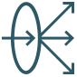 Load Balancer](https://www.oracle.com/cloud/networking/flexible-load-balancer/) | [ Network Load Balancer](https://www.oracle.com/cloud/networking/flexible-network-load-balancer/)

### **Exoscale**

[ Elastic IP (managed health checks)](https://community.exoscale.com/product/networking/eip/) | [ Network Load Balancer](https://community.exoscale.com/product/networking/nlb/) | [ F5 BIG-IP Virtual Appliances](https://www.exoscale.com/marketplace/listing/f5-big-ip-virtual-appliances-byol/) _(Marketplace)_


## **Network – Misc**

### **AWS**

[ NAT Gateways](https://docs.aws.amazon.com/vpc/latest/userguide/vpc-nat-gateway.html) | [ Transit Gateway](https://aws.amazon.com/transit-gateway/) | [ VPC Lattice](https://aws.amazon.com/vpc/lattice/)

### **Azure**

[ NAT Gateway](https://learn.microsoft.com/en-us/azure/nat-gateway/nat-overview) | [ Network Watcher](https://azure.microsoft.com/en-us/products/network-watcher/) | [ Virtual Network Manager](https://azure.microsoft.com/en-us/products/virtual-network-manager/)

### **GCP**

[ Cloud NAT](https://docs.cloud.google.com/nat/docs) | [ Network Intelligence Center](https://cloud.google.com/network-intelligence-center) | [ Network Service Tiers](https://docs.cloud.google.com/network-tiers/docs/overview)

### **Oracle**

[ Dynamic Routing Gateway](https://www.oracle.com/cloud/networking/dynamic-routing-gateway/) | [IP Address Insights](https://www.oracle.com/cloud/networking/ip-address-insights/) | [ NAT Gateway](https://docs.oracle.com/en-us/iaas/Content/Network/Tasks/NATgateway.htm) | [ Service Gateway](https://www.oracle.com/cloud/networking/service-gateway/) | [Web Application Acceleration](https://www.oracle.com/cloud/networking/web-application-accelerator/)

### **Exoscale**

[ VyOS Universal Router](https://www.exoscale.com/marketplace/listing/vyos-universal-router/) _(Marketplace)_


## **Optimization**

### **AWS**

[ Compute Optimizer](https://aws.amazon.com/compute-optimizer/) | [ Cost Optimization Hub](https://aws.amazon.com/aws-cost-management/cost-optimization-hub/) | [ Trusted Advisor](https://aws.amazon.com/premiumsupport/technology/trusted-advisor/)

### **Azure**

[ Advisor](https://azure.microsoft.com/en-us/products/advisor/)

### **GCP**

[Active Assist (Recommender)](https://docs.cloud.google.com/recommender/docs/whatis-activeassist)

### **Oracle**

[ Cloud Advisor](https://www.oracle.com/cloud/cost-management-and-governance/cloud-advisor/) | [ Ops Insights](https://www.oracle.com/manageability/ops-insights/)


## **Queue**

### **AWS**

[ Simple Queue Service (SQS)](https://aws.amazon.com/sqs/)

### **Azure**

[ Queue Storage](https://azure.microsoft.com/en-us/products/storage/queues/) | [ Service Bus](https://azure.microsoft.com/en-us/products/service-bus/)

### **GCP**

[ Cloud Tasks](https://docs.cloud.google.com/tasks/docs)

### **Oracle**

[ Queue](https://www.oracle.com/cloud/queue/)

### **Exoscale**

[ Managed Kafka](https://www.exoscale.com/dbaas/kafka/) | [ Managed Valkey](https://www.exoscale.com/dbaas/valkey/) | [ RabbitMQ / ActiveMQ on Compute](https://www.exoscale.com/compute/) _(Workaround)_


## **Resource Mgmt**

### **AWS**

[ Account](https://aws.amazon.com/account/) | [ Control Tower](https://aws.amazon.com/controltower/) | [ Organizations](https://aws.amazon.com/organizations/) | [ Resource Access Manager (RAM)](https://aws.amazon.com/ram/) | [ Service Catalog](https://aws.amazon.com/servicecatalog/)

### **Azure**

[Azure Resource Manager (ARM)](https://learn.microsoft.com/en-us/azure/azure-resource-manager/management/overview) | [ Management Groups](https://learn.microsoft.com/en-us/azure/governance/management-groups/overview) | [ Microsoft Entra Tenant](https://learn.microsoft.com/en-us/entra/fundamentals/create-new-tenant) | [ Resource Graph](https://learn.microsoft.com/en-us/azure/governance/resource-graph/overview) | [ Resource Groups](https://learn.microsoft.com/en-us/azure/azure-resource-manager/management/manage-resource-groups-portal)

### **GCP**

[ Cloud Asset Inventory](https://cloud.google.com/asset-inventory) | [Organization](https://docs.cloud.google.com/resource-manager/docs/creating-managing-organization) | [ Projects](https://docs.cloud.google.com/resource-manager/docs/creating-managing-projects) | [Resource Manager](https://docs.cloud.google.com/resource-manager/docs)

### **Oracle**

[ Compartments](https://docs.oracle.com/en-us/iaas/Content/Identity/compartments/managingcompartments.htm) | [ Organization Management](https://docs.oracle.com/en-us/iaas/Content/General/organization/home.htm) | [ Resource Manager](https://www.oracle.com/cloud/cloud-native/resource-manager/) | [ Tagging](https://docs.oracle.com/en-us/iaas/Content/Tagging/home.htm)

### **Exoscale**

[ Labels](https://community.exoscale.com/product/compute/instances/how-to/labels/) | [ Organization Policy](https://community.exoscale.com/reference/api/iam/organization-policy/) | [ Organizations](https://community.exoscale.com/platform/organization/) | [ Portal](https://portal.exoscale.com/)


## **SAP**

### **AWS**

[SAP on AWS](https://aws.amazon.com/sap/)

### **Azure**

[ SAP on Azure](https://azure.microsoft.com/en-us/solutions/sap/)

### **GCP**

[SAP on Google Cloud](https://cloud.google.com/solutions/sap)

### **Oracle**

[Oracle Cloud for SAP](https://www.oracle.com/sap/cloud/)


## **Security**

### **AWS**

[ Detective](https://aws.amazon.com/detective/) | [ GuardDuty](https://aws.amazon.com/guardduty/) | [ Inspector](https://aws.amazon.com/inspector/) | [ Macie](https://aws.amazon.com/macie/) | [ Security Hub](https://aws.amazon.com/security-hub/) | [ Security Lake](https://aws.amazon.com/security-lake/) | [ Shield](https://aws.amazon.com/shield/)

### **Azure**

[ DDoS Protection](https://azure.microsoft.com/en-us/products/ddos-protection/) | [ Defender for Cloud](https://www.microsoft.com/en-us/security/business/cloud-security/microsoft-defender-cloud) | [Defender for Cloud Apps](https://www.microsoft.com/en-us/security/business/siem-and-xdr/microsoft-defender-cloud-apps) | [ Microsoft Sentinel](https://www.microsoft.com/en-us/security/business/siem-and-xdr/microsoft-sentinel-siem)

### **GCP**

[ Cloud Armor](https://cloud.google.com/security/products/armor) | [ Google Security Operations (formerly Chronicle)](https://cloud.google.com/security/products/security-operations) | [ Security Command Center](https://cloud.google.com/security/products/security-command-center) | [ Sensitive Data Protection](https://cloud.google.com/security/products/sensitive-data-protection)

### **Oracle**

[ Bastion](https://www.oracle.com/security/cloud-security/bastion/) | [ Data Safe](https://www.oracle.com/security/database-security/data-safe/) | [ OCI Cloud Guard](https://www.oracle.com/security/cloud-security/cloud-guard/) | [ Vulnerability Scanning](https://www.oracle.com/security/cloud-security/vulnerability-scanning-service/)

### **Exoscale**

[ Encryption](https://www.exoscale.com/compliance/encryption/) | [ Security Model & Bug Bounty](https://www.exoscale.com/security/) | [ ANANTIS TrapEye](https://www.exoscale.com/marketplace/listing/anantis-trapeye/) _(Marketplace)_ | [ Offensity by A1 Digital](https://www.exoscale.com/marketplace/listing/offensity/) _(Marketplace)_ | [ Panop Exposure Management](https://www.exoscale.com/marketplace/listing/panop-autonomous-exposure-management/) _(Marketplace)_


## **Storage**

### **AWS**

[ Backup](https://aws.amazon.com/backup/) | [ Elastic Block Store (EBS)](https://aws.amazon.com/ebs/) | [ Elastic File System (EFS)](https://aws.amazon.com/efs/) | [ FSx](https://aws.amazon.com/fsx/) | [ S3 Glacier storage classes](https://aws.amazon.com/s3/storage-classes/glacier/) | [ Simple Storage Service (S3)](https://aws.amazon.com/s3/) | [ Storage Gateway](https://aws.amazon.com/storagegateway/)

### **Azure**

[ Azure Backup](https://azure.microsoft.com/en-us/products/backup/) | [ Blob Storage](https://azure.microsoft.com/en-us/products/storage/blobs/) | [ Confidential Ledger](https://azure.microsoft.com/en-us/products/azure-confidential-ledger/) | [ Data Lake Storage](https://azure.microsoft.com/en-us/products/storage/data-lake-storage/) | [ Disk Storage](https://azure.microsoft.com/en-us/products/storage/disks/) | [ Elastic SAN](https://azure.microsoft.com/en-us/products/storage/elastic-san/) | [ Files](https://azure.microsoft.com/en-us/products/storage/files/) | [Managed Lustre](https://azure.microsoft.com/en-us/products/managed-lustre/) | [ NetApp Files](https://azure.microsoft.com/en-us/products/netapp/)

### **GCP**

[Backup and DR Service](https://cloud.google.com/backup-disaster-recovery) | [ Cloud Storage](https://cloud.google.com/storage) | [ Filestore](https://cloud.google.com/filestore) | [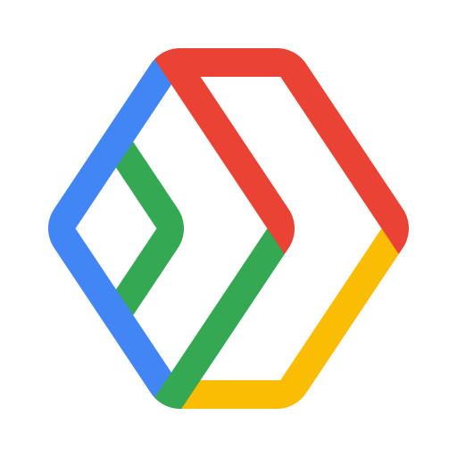 Hyperdisk](https://docs.cloud.google.com/compute/docs/disks/hyperdisks) | [Managed Lustre](https://cloud.google.com/products/managed-lustre) | [ Persistent Disk](https://cloud.google.com/persistent-disk)

### **Oracle**

[ Archive Storage](https://www.oracle.com/cloud/storage/archive-storage/) | [ Block Volume](https://www.oracle.com/cloud/storage/block-volumes/) | [ File Storage](https://www.oracle.com/cloud/storage/file-storage/) | [ File Storage with Lustre](https://www.oracle.com/cloud/storage/file-storage-with-lustre/) | [ Object Storage](https://www.oracle.com/cloud/storage/object-storage/)

### **Exoscale**

[ Backup Solutions](https://www.exoscale.com/backup/) | [ Block Storage](https://www.exoscale.com/block-storage/) | [ Object Storage (S3-compatible)](https://www.exoscale.com/object-storage/) | [ Object Storage Classes (Warm / Cold)](https://www.exoscale.com/object-storage/classes/) | [ Snapshots](https://community.exoscale.com/product/compute/instances/how-to/snapshot/) | [ Acronis Cyber Protect](https://www.exoscale.com/marketplace/listing/acronis-cyber-protect/) _(Marketplace)_ | [ QuTScloud Cloud NAS](https://www.exoscale.com/marketplace/listing/qnap-qutscloud/) _(Marketplace)_


## **Workflow**

### **AWS**

[ Managed Workflows for Apache Airflow (MWAA)](https://aws.amazon.com/managed-workflows-for-apache-airflow/) | [Simple Workflow Service (SWF)](https://aws.amazon.com/swf/) | [ Step Functions](https://aws.amazon.com/step-functions/)

### **Azure**

[ Logic Apps](https://azure.microsoft.com/en-us/products/logic-apps/)

### **GCP**

[Application Integration](https://cloud.google.com/application-integration) | [ Managed Service for Apache Airflow (formerly Cloud Composer)](https://cloud.google.com/products/managed-service-for-apache-airflow) | [ Workflows](https://cloud.google.com/workflows)

### **Oracle**

[ Oracle Integration (Process Automation)](https://www.oracle.com/integration/application-integration/)

### **Exoscale**

[ Open-source workflow engines (n8n, Argo Workflows) on SKS](https://www.exoscale.com/sks/) _(Workaround)_

<!-- MAPPING:END -->

<!-- CROSSWALK:START (generated by scripts/build.py, do not edit by hand) -->

## AWS → Exoscale Service Crosswalk

Service-by-service equivalents. ✅ Native · 🛒 Marketplace · 🔧 Workaround · ❌ No equivalent

| Category | AWS service | Exoscale | Status | Notes |
|---|---|---|---|---|
| Compute | [Amazon EC2](https://aws.amazon.com/ec2/) | [ Compute Instances](https://www.exoscale.com/compute/)<br>[ Instance Pools](https://community.exoscale.com/product/compute/instances/how-to/instance-pools/)<br>[ Custom Templates](https://community.exoscale.com/product/compute/instances/how-to/custom-templates/) | ✅ Native |  |
| Compute | [Amazon EC2 GPU instances](https://aws.amazon.com/ec2/instance-types/#Accelerated_Computing) | [ GPU Instances](https://www.exoscale.com/gpu/) | ✅ Native |  |
| Compute | [Amazon Lightsail](https://aws.amazon.com/lightsail/) | [ Compute Instances](https://www.exoscale.com/compute/)<br>[ SKS](https://www.exoscale.com/sks/) | ✅ Native |  |
| Compute | [AWS Lambda](https://aws.amazon.com/lambda/) |  Serverless _(Roadmap)_<br>[ SKS](https://www.exoscale.com/sks/) | 🔧 Workaround | Serverless is on the roadmap; today run functions on SKS with an open-source FaaS framework (e.g. Knative, OpenFaaS). |
| Compute | [AWS Elastic Beanstalk](https://aws.amazon.com/elasticbeanstalk/) | [ SKS](https://www.exoscale.com/sks/) | 🔧 Workaround | Deploy applications on Kubernetes instead of a PaaS wrapper around VMs. |
| Compute | [AWS App Runner](https://aws.amazon.com/apprunner/) | [ SKS](https://www.exoscale.com/sks/) | 🔧 Workaround | SKS combined with a developer portal / service catalogue. |
| Compute | [AWS Batch](https://aws.amazon.com/batch/) | [ SKS](https://www.exoscale.com/sks/)<br>[ Karpenter for SKS](https://www.exoscale.com/sks/karpenter/) | 🔧 Workaround | Kubernetes Jobs with Karpenter autoscaling. |
| Compute | [AWS Outposts](https://aws.amazon.com/outposts/) | — | ❌ No equivalent |  |
| Compute | [AWS Local Zones](https://aws.amazon.com/about-aws/global-infrastructure/localzones/) | — | ❌ No equivalent |  |
| Compute | [AWS Wavelength](https://aws.amazon.com/wavelength/) | [ Exoscale EDGE](https://www.exoscale.com/edge/) | ✅ Native | Exoscale EDGE brings a small Exoscale zone to 5G networks. |
| Containers | [Amazon EKS](https://aws.amazon.com/eks/) | [ SKS](https://www.exoscale.com/sks/) | ✅ Native |  |
| Containers | [Amazon ECS](https://aws.amazon.com/ecs/) | [ SKS](https://www.exoscale.com/sks/) | ✅ Native | Kubernetes rather than a proprietary orchestrator. |
| Containers | [AWS Fargate](https://aws.amazon.com/fargate/) | [ SKS](https://www.exoscale.com/sks/)<br>[ Karpenter for SKS](https://www.exoscale.com/sks/karpenter/) | 🔧 Workaround | Managed control plane with autoscaled nodes; no per-pod serverless billing. |
| Containers | [Amazon ECR](https://aws.amazon.com/ecr/) | [ 8gears Container Registry](https://www.exoscale.com/marketplace/listing/container-registry/) _(Marketplace)_ | 🛒 Marketplace |  |
| Containers | [Red Hat OpenShift Service on AWS (ROSA)](https://aws.amazon.com/rosa/) | [ APPUiO Managed OpenShift](https://www.exoscale.com/marketplace/listing/appuio-container-platform/) _(Marketplace)_ | 🛒 Marketplace |  |
| Storage | [Amazon S3](https://aws.amazon.com/s3/) | [ Object Storage](https://www.exoscale.com/object-storage/) | ✅ Native | S3-compatible API. |
| Storage | [Amazon EBS](https://aws.amazon.com/ebs/) | [ Block Storage](https://www.exoscale.com/block-storage/) | ✅ Native |  |
| Storage | [Amazon EFS](https://aws.amazon.com/efs/) | — | ❌ No equivalent |  |
| Storage | [AWS Backup](https://aws.amazon.com/backup/) | [ Acronis Cyber Protect](https://www.exoscale.com/marketplace/listing/acronis-cyber-protect/) _(Marketplace)_<br>[ Backup Solutions](https://www.exoscale.com/backup/) | 🛒 Marketplace |  |
| Storage | [Amazon FSx for Windows File Server](https://aws.amazon.com/fsx/windows/) | [ Compute Instances](https://www.exoscale.com/compute/) | 🔧 Workaround | Windows Server file shares on Compute Instances. |
| Storage | [Amazon FSx for Lustre](https://aws.amazon.com/fsx/lustre/) | — | ❌ No equivalent |  |
| Storage | [Amazon FSx for NetApp ONTAP](https://aws.amazon.com/fsx/netapp-ontap/) | — | ❌ No equivalent |  |
| Storage | [AWS Storage Gateway](https://aws.amazon.com/storagegateway/) | — | ❌ No equivalent |  |
| Databases | [Amazon RDS](https://aws.amazon.com/rds/) | [ Managed PostgreSQL](https://www.exoscale.com/dbaas/postgresql/)<br>[ Managed MySQL](https://www.exoscale.com/dbaas/mysql/) | ✅ Native | PostgreSQL and MySQL engines. |
| Databases | [Amazon Aurora](https://aws.amazon.com/rds/aurora/) | [ Managed PostgreSQL](https://www.exoscale.com/dbaas/postgresql/)<br>[ Managed MySQL](https://www.exoscale.com/dbaas/mysql/) | ✅ Native |  |
| Databases | [Amazon DynamoDB](https://aws.amazon.com/dynamodb/) | [ Managed Valkey](https://www.exoscale.com/dbaas/valkey/)<br>[ Managed PostgreSQL](https://www.exoscale.com/dbaas/postgresql/) | 🔧 Workaround | No managed wide-column/document store; use Valkey for key-value or PostgreSQL JSONB. |
| Databases | [Amazon ElastiCache](https://aws.amazon.com/elasticache/) | [ Managed Valkey](https://www.exoscale.com/dbaas/valkey/) | ✅ Native |  |
| Databases | [Amazon MemoryDB](https://aws.amazon.com/memorydb/) | [ Managed Valkey](https://www.exoscale.com/dbaas/valkey/) | ✅ Native |  |
| Databases | [Amazon OpenSearch Service](https://aws.amazon.com/opensearch-service/) | [ Managed OpenSearch](https://www.exoscale.com/dbaas/opensearch/) | ✅ Native |  |
| Databases | [Amazon DocumentDB](https://aws.amazon.com/documentdb/) | — | ❌ No equivalent |  |
| Databases | [Amazon Keyspaces](https://aws.amazon.com/keyspaces/) | [ Compute Instances](https://www.exoscale.com/compute/) | 🔧 Workaround | Self-managed Apache Cassandra on Compute Instances. |
| Databases | [Amazon Neptune](https://aws.amazon.com/neptune/) | [ Compute Instances](https://www.exoscale.com/compute/) | 🔧 Workaround | Self-managed graph database on Compute Instances. |
| Databases | [Amazon Timestream](https://aws.amazon.com/timestream/) | [ Managed Thanos](https://www.exoscale.com/dbaas/thanos/) | ✅ Native | Prometheus-compatible time-series storage. |
| Networking & CDN | [Amazon VPC](https://aws.amazon.com/vpc/) | [ Virtual Private Cloud](https://www.exoscale.com/virtual-private-cloud/)<br>[ Private Networks](https://community.exoscale.com/product/networking/private-network/)<br>[ Security Groups](https://community.exoscale.com/product/networking/security-group/) | ✅ Native |  |
| Networking & CDN | [Amazon CloudFront](https://aws.amazon.com/cloudfront/) | [ CDN](https://www.exoscale.com/cdn/) | ✅ Native |  |
| Networking & CDN | [Amazon Route 53](https://aws.amazon.com/route53/) | [ DNS](https://www.exoscale.com/dns/) | ✅ Native |  |
| Networking & CDN | [AWS Direct Connect](https://aws.amazon.com/directconnect/) | [ Private Connect](https://community.exoscale.com/product/networking/private-connect/) | ✅ Native |  |
| Networking & CDN | [Elastic Load Balancing](https://aws.amazon.com/elasticloadbalancing/) | [ Network Load Balancer](https://community.exoscale.com/product/networking/nlb/) | ✅ Native | Layer 4 load balancing within a zone; for L7 run an ingress controller on SKS. |
| Networking & CDN | [AWS Transit Gateway](https://aws.amazon.com/transit-gateway/) | — | ❌ No equivalent |  |
| Networking & CDN | [AWS PrivateLink](https://aws.amazon.com/privatelink/) | [ Private Networks](https://community.exoscale.com/product/networking/private-network/) | 🔧 Workaround | Connect services over Private Networks. |
| Networking & CDN | [AWS Global Accelerator](https://aws.amazon.com/global-accelerator/) | — | ❌ No equivalent |  |
| Generative AI | [Amazon Bedrock](https://aws.amazon.com/bedrock/) | [ Managed Inference](https://www.exoscale.com/ai-cloud-infrastructure/managed-inference/)<br>[ Dedicated Inference](https://www.exoscale.com/ai-cloud-infrastructure/dedicated-inference/) | ✅ Native | Open-weight models (e.g. from Hugging Face) or your own models, OpenAI-compatible API. |
| AI & Machine Learning | [Amazon SageMaker](https://aws.amazon.com/sagemaker/) | [ GPU Instances](https://www.exoscale.com/gpu/)<br>[ SKS](https://www.exoscale.com/sks/) | 🔧 Workaround | GPU Instances or SKS with open-source MLOps tooling. |
| Generative AI | [Amazon Q](https://aws.amazon.com/q/) | — | ❌ No equivalent |  |
| AI & Machine Learning | [Amazon Rekognition](https://aws.amazon.com/rekognition/) | [ Dedicated Inference](https://www.exoscale.com/ai-cloud-infrastructure/dedicated-inference/) | 🔧 Workaround | No managed API; serve an equivalent open-weight model on Dedicated Inference. |
| AI & Machine Learning | [Amazon Polly](https://aws.amazon.com/polly/) | [ Dedicated Inference](https://www.exoscale.com/ai-cloud-infrastructure/dedicated-inference/) | 🔧 Workaround | No managed API; serve an equivalent open-weight model on Dedicated Inference. |
| AI & Machine Learning | [Amazon Transcribe](https://aws.amazon.com/transcribe/) | [ Dedicated Inference](https://www.exoscale.com/ai-cloud-infrastructure/dedicated-inference/) | 🔧 Workaround | No managed API; serve an equivalent open-weight model on Dedicated Inference. |
| AI & Machine Learning | [Amazon Comprehend](https://aws.amazon.com/comprehend/) | [ Dedicated Inference](https://www.exoscale.com/ai-cloud-infrastructure/dedicated-inference/) | 🔧 Workaround | No managed API; serve an equivalent open-weight model on Dedicated Inference. |
| AI & Machine Learning | [Amazon Textract](https://aws.amazon.com/textract/) | [ Dedicated Inference](https://www.exoscale.com/ai-cloud-infrastructure/dedicated-inference/) | 🔧 Workaround | No managed API; serve an equivalent open-weight model on Dedicated Inference. |
| AI & Machine Learning | [Amazon Personalize](https://aws.amazon.com/personalize/) | [ Dedicated Inference](https://www.exoscale.com/ai-cloud-infrastructure/dedicated-inference/) | 🔧 Workaround | No managed API; serve an equivalent open-weight model on Dedicated Inference. |
| AI & Machine Learning | [Amazon Forecast](https://aws.amazon.com/forecast/) | [ Dedicated Inference](https://www.exoscale.com/ai-cloud-infrastructure/dedicated-inference/) | 🔧 Workaround | No managed API; serve an equivalent open-weight model on Dedicated Inference. |
| Analytics | [Amazon Athena](https://aws.amazon.com/athena/) |  Data Platform _(Roadmap)_ | ❌ No equivalent | Data Platform is on the roadmap. |
| Analytics | [Amazon EMR](https://aws.amazon.com/emr/) | [ SKS](https://www.exoscale.com/sks/) | 🔧 Workaround | Spark and friends on Kubernetes. |
| Analytics | [Amazon Redshift](https://aws.amazon.com/redshift/) | [ Managed ClickHouse](https://www.exoscale.com/dbaas/clickhouse/)<br>[ Object Storage](https://www.exoscale.com/object-storage/) | ✅ Native | Columnar analytics with ClickHouse, Object Storage for the lake tier. |
| Analytics | [AWS Glue](https://aws.amazon.com/glue/) | [ SKS](https://www.exoscale.com/sks/)<br>[ Compute Instances](https://www.exoscale.com/compute/) | 🔧 Workaround | Open-source ETL tooling on SKS or Compute. |
| Analytics | [Amazon Kinesis](https://aws.amazon.com/kinesis/) | [ Managed Kafka](https://www.exoscale.com/dbaas/kafka/) | 🔧 Workaround | Kafka-based streaming. |
| Analytics | [Amazon MSK](https://aws.amazon.com/msk/) | [ Managed Kafka](https://www.exoscale.com/dbaas/kafka/) | ✅ Native |  |
| Analytics | [Amazon QuickSight](https://aws.amazon.com/quicksight/) | [ Metabase](https://www.exoscale.com/marketplace/listing/glasskube-metabase/) _(Marketplace)_ | 🛒 Marketplace |  |
| Analytics | [AWS Lake Formation](https://aws.amazon.com/lake-formation/) | [ Object Storage](https://www.exoscale.com/object-storage/)<br>[ Compute Instances](https://www.exoscale.com/compute/) | 🔧 Workaround | Object Storage with open-source lakehouse tooling on Compute. |
| Security & Compliance | [AWS IAM](https://aws.amazon.com/iam/) | [ IAM](https://community.exoscale.com/product/security/iam/) | ✅ Native |  |
| Security & Compliance | [AWS IAM Identity Center](https://aws.amazon.com/iam/identity-center/) | [ IAM](https://community.exoscale.com/product/security/iam/)<br>[ Keycloak by Servala](https://www.exoscale.com/marketplace/listing/keycloak-by-servala/) _(Marketplace)_ | 🛒 Marketplace | Single sign-on via an identity provider such as Keycloak. |
| Security & Compliance | [AWS KMS](https://aws.amazon.com/kms/) | [ Key Management Service (KMS)](https://community.exoscale.com/product/security/kms/) | ✅ Native |  |
| Security & Compliance | [AWS Secrets Manager](https://aws.amazon.com/secrets-manager/) | [ HashiCorp Vault](https://www.exoscale.com/marketplace/listing/glasskube-vault/) _(Marketplace)_ | 🛒 Marketplace |  |
| Security & Compliance | [AWS Shield](https://aws.amazon.com/shield/) | — | ❌ No equivalent |  |
| Security & Compliance | [AWS WAF](https://aws.amazon.com/waf/) | [ BunkerWeb WAF](https://www.exoscale.com/marketplace/listing/bunkerweb-community/) _(Marketplace)_ | 🛒 Marketplace |  |
| Security & Compliance | [Amazon GuardDuty](https://aws.amazon.com/guardduty/) | [ ANANTIS TrapEye](https://www.exoscale.com/marketplace/listing/anantis-trapeye/) _(Marketplace)_ | 🛒 Marketplace |  |
| Security & Compliance | [AWS Security Hub](https://aws.amazon.com/security-hub/) | [ Panop](https://www.exoscale.com/marketplace/listing/panop-autonomous-exposure-management/) _(Marketplace)_ | 🛒 Marketplace |  |
| Security & Compliance | [Amazon Inspector](https://aws.amazon.com/inspector/) | — | ❌ No equivalent | Use a third-party vulnerability scanner. |
| Security & Compliance | [Amazon Macie](https://aws.amazon.com/macie/) | [ Compute Instances](https://www.exoscale.com/compute/) | 🔧 Workaround | Open-source data-discovery tooling on Compute. |
| Security & Compliance | [AWS Network Firewall](https://aws.amazon.com/network-firewall/) | [ FortiGate](https://www.exoscale.com/marketplace/listing/fortigate-virtual-appliances-byol/) _(Marketplace)_<br>[ Check Point CloudGuard](https://www.exoscale.com/marketplace/listing/check-point-cloudguard-iaas-byol/) _(Marketplace)_<br>[ Security Groups](https://community.exoscale.com/product/networking/security-group/) | 🛒 Marketplace |  |
| Management & Governance | [Amazon CloudWatch](https://aws.amazon.com/cloudwatch/) | [ Managed Grafana](https://www.exoscale.com/grafana/)<br>[ Managed Thanos](https://www.exoscale.com/dbaas/thanos/) | 🔧 Workaround | Bring your own exporters into Grafana and Thanos. |
| Management & Governance | [AWS CloudTrail](https://aws.amazon.com/cloudtrail/) | [ Audit Trail](https://community.exoscale.com/platform/audit-trail/) | ✅ Native |  |
| Management & Governance | [AWS Organizations](https://aws.amazon.com/organizations/) | [ Organizations](https://community.exoscale.com/platform/organization/) | ✅ Native | Fewer governance controls than AWS Organizations. |
| Management & Governance | [AWS Control Tower](https://aws.amazon.com/controltower/) | — | ❌ No equivalent |  |
| Management & Governance | [AWS Systems Manager](https://aws.amazon.com/systems-manager/) | [ Compute Instances](https://www.exoscale.com/compute/) | 🔧 Workaround | Configuration management tooling such as Ansible, Puppet or Chef. |
| Management & Governance | [AWS Config](https://aws.amazon.com/config/) | — | ❌ No equivalent |  |
| Management & Governance | [AWS Well-Architected Tool](https://aws.amazon.com/well-architected-tool/) | — | ❌ No equivalent |  |
| Management & Governance | [AWS Cost Explorer & Budgets](https://aws.amazon.com/aws-cost-management/aws-cost-explorer/) | — | ❌ No equivalent |  |
| Developer Tools | [AWS CloudFormation](https://aws.amazon.com/cloudformation/) | [ Terraform Provider](https://registry.terraform.io/providers/exoscale/exoscale/latest)<br>[ CLI (exo)](https://community.exoscale.com/tools/command-line-interface/) | ✅ Native |  |
| Developer Tools | [AWS CDK](https://aws.amazon.com/cdk/) | [ Pulumi Provider](https://www.pulumi.com/registry/packages/exoscale/)<br>[ Terraform Provider](https://registry.terraform.io/providers/exoscale/exoscale/latest) | ✅ Native |  |
| Developer Tools | [AWS CodePipeline](https://aws.amazon.com/codepipeline/) | [ GitLab by Servala](https://www.exoscale.com/marketplace/listing/gitlab-by-servala/) _(Marketplace)_<br>[ Forgejo by Servala](https://www.exoscale.com/marketplace/listing/forgejo-by-servala/) _(Marketplace)_ | 🛒 Marketplace | Git forge with CI/CD; runners on Compute or SKS. |
| Developer Tools | [AWS CodeBuild](https://aws.amazon.com/codebuild/) | [ GitLab by Servala](https://www.exoscale.com/marketplace/listing/gitlab-by-servala/) _(Marketplace)_<br>[ Forgejo by Servala](https://www.exoscale.com/marketplace/listing/forgejo-by-servala/) _(Marketplace)_ | 🛒 Marketplace | Git forge with CI/CD; runners on Compute or SKS. |
| Developer Tools | [AWS CodeDeploy](https://aws.amazon.com/codedeploy/) | [ GitLab by Servala](https://www.exoscale.com/marketplace/listing/gitlab-by-servala/) _(Marketplace)_<br>[ Forgejo by Servala](https://www.exoscale.com/marketplace/listing/forgejo-by-servala/) _(Marketplace)_ | 🛒 Marketplace | Git forge with CI/CD; runners on Compute or SKS. |
| Developer Tools | [AWS X-Ray](https://aws.amazon.com/xray/) | [ Managed Grafana](https://www.exoscale.com/grafana/)<br>[ Managed Thanos](https://www.exoscale.com/dbaas/thanos/) | 🔧 Workaround | Prometheus / Thanos / Grafana stack. |
| Application Integration | [Amazon SQS](https://aws.amazon.com/sqs/) | [ Managed Kafka](https://www.exoscale.com/dbaas/kafka/)<br>[ Managed Valkey](https://www.exoscale.com/dbaas/valkey/) | ✅ Native |  |
| Application Integration | [Amazon SNS](https://aws.amazon.com/sns/) | — | ❌ No equivalent |  |
| Application Integration | [Amazon EventBridge](https://aws.amazon.com/eventbridge/) | [ Managed Kafka](https://www.exoscale.com/dbaas/kafka/) | ✅ Native |  |
| Application Integration | [AWS Step Functions](https://aws.amazon.com/step-functions/) | [ SKS](https://www.exoscale.com/sks/) | 🔧 Workaround | Open-source workflow engines (e.g. n8n, Argo Workflows) on SKS. |
| Application Integration | [Amazon API Gateway](https://aws.amazon.com/api-gateway/) | [ SKS](https://www.exoscale.com/sks/)<br>[ Compute Instances](https://www.exoscale.com/compute/) | 🔧 Workaround | Open-source API gateway on SKS or Compute. |
| Application Integration | [AWS AppSync](https://aws.amazon.com/appsync/) | [ SKS](https://www.exoscale.com/sks/)<br>[ Compute Instances](https://www.exoscale.com/compute/) | 🔧 Workaround | Open-source GraphQL gateway on SKS or Compute. |
| Application Integration | [Amazon MQ](https://aws.amazon.com/amazon-mq/) | [ Compute Instances](https://www.exoscale.com/compute/)<br>[ Managed Kafka](https://www.exoscale.com/dbaas/kafka/) | 🔧 Workaround | RabbitMQ or ActiveMQ on Compute, or Managed Kafka. |
| Internet of Things | [AWS IoT Core](https://aws.amazon.com/iot-core/) | [ SKS](https://www.exoscale.com/sks/)<br>[ Compute Instances](https://www.exoscale.com/compute/) | 🔧 Workaround | Self-hosted MQTT broker on SKS or Compute. |
| Internet of Things | [AWS IoT Greengrass](https://aws.amazon.com/greengrass/) | — | ❌ No equivalent |  |
| Internet of Things | [AWS IoT Device Management](https://aws.amazon.com/iot-device-management/) | — | ❌ No equivalent |  |
| Internet of Things | [AWS IoT SiteWise](https://aws.amazon.com/iot-sitewise/) | [ Compute Instances](https://www.exoscale.com/compute/) | 🔧 Workaround | Open-source industrial IoT tooling on Compute. |
| Migration & Transfer | [AWS Application Migration Service](https://aws.amazon.com/application-migration-service/) | [ Custom Templates](https://community.exoscale.com/product/compute/instances/how-to/custom-templates/) | 🔧 Workaround | Import VM images as Custom Templates. |
| Migration & Transfer | [AWS Database Migration Service](https://aws.amazon.com/dms/) | [ DBaaS Migration](https://community.exoscale.com/product/dbaas/service-specific/postgresql/how-to/postgresql-migration/) | ✅ Native | Online migration into Managed PostgreSQL, MySQL and Valkey. |
| Migration & Transfer | [AWS DataSync](https://aws.amazon.com/datasync/) | [ Object Storage](https://www.exoscale.com/object-storage/) | 🔧 Workaround | S3-compatible transfer tools (rclone, AWS CLI). |
| Migration & Transfer | [AWS Snow Family](https://aws.amazon.com/snow/) | — | ❌ No equivalent |  |
| Business Applications | [Amazon SES](https://aws.amazon.com/ses/) | — | ❌ No equivalent |  |
| Business Applications | [Amazon Connect](https://aws.amazon.com/connect/) | — | ❌ No equivalent |  |
| Business Applications | [Amazon WorkSpaces](https://aws.amazon.com/workspaces/) | [ oneclick VDI & DaaS](https://www.exoscale.com/marketplace/listing/oneclick-vdi-daas/) _(Marketplace)_ | 🛒 Marketplace |  |
| Business Applications | [Amazon AppStream 2.0](https://aws.amazon.com/appstream2/) | — | ❌ No equivalent |  |
| Business Applications | [AWS Wickr](https://aws.amazon.com/wickr/) | — | ❌ No equivalent |  |
| Specialized | [Amazon Braket](https://aws.amazon.com/braket/) | — | ❌ No equivalent |  |
| Specialized | [AWS Ground Station](https://aws.amazon.com/ground-station/) | — | ❌ No equivalent |  |
| Specialized | [Amazon Managed Blockchain](https://aws.amazon.com/managed-blockchain/) | — | ❌ No equivalent |  |

<!-- CROSSWALK:END -->

# Wrap Up

If you think the mapping can be improved, please do open a PR with any updates and submit any issues. Also, I will continue to improve this, so you might want to star this repository to revisit.

## Contribution

- Open a pull request with improvements
- Discuss ideas in issues
- Spread the word

## License

[](https://opensource.org/licenses/Apache-2.0)

## Authors

- [Dr. Milan Milanović](https://milan.milanovic.org) -  CTO at [3MD](https://3mdinc.com).
